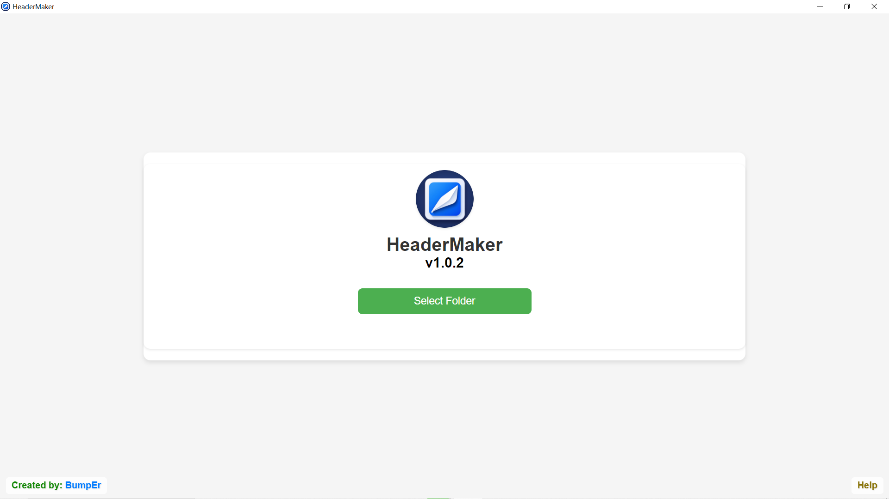
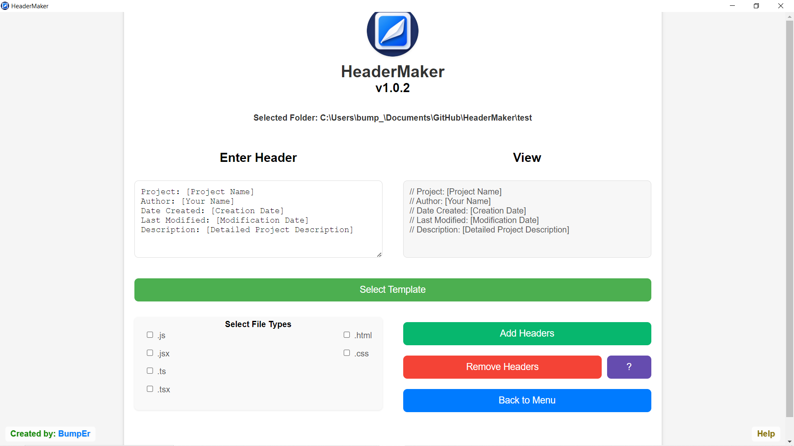

<div align="center">

# HeaderMaker

</div>

<div align="center">
  
</div>

---

## Table of Contents

- [Introduction](#introduction)
- [Features](#features)
- [Installation](#installation)
- [Screenshots](#screenshots)
- [Contact](#contact)

---

## Introduction

**HeaderMaker** is a desktop application designed to create custom header comments for your
code files within a selected directory. Whether you're a developer looking to standardize your codebase or a project manager aiming for better code
documentation, HeaderMaker provides seamless header generation.

---

## Features

- **Customizable Header Formats:** Define and customize your header formats to match your project's needs.
- **Intuitive User Interface:** Navigate the application effortlessly with a clean and modern UI.
- **Real-Time Preview:** See your header designs update instantly as you modify them.
- **Multiple File Support:** Generate headers for various file types, including JavaScript, TypeScript, HTML, CSS.

---

## Installation

Follow these steps to install HeaderMaker on your system:

1. **Clone the Repository:**

  ```bash
   git clone https://github.com/NewBumpEr/HeaderMaker.git
   ```

2. **Navigate to the Project Directory:**

  ```bash
   cd headermaker
  ```

3. **Install Dependencies:**

  ```bash
   npm install
  ```

4. **Run the Application:**

  ```bash
   npm start
   ```

---

> **Note:** Ensure you have [Node.js](https://nodejs.org/) installed on your machine.

---

## Screenshots

Here are some screenshots of HeaderMaker in action:

### Home Screen



### Customization Panel



---

## License

This project is licensed under the MIT License. See the [LICENSE](LICENSE) file for details.

---

## Contact

For any questions or feedback, please contact:

- **Author:** Pavlo Mytrovtsiy
- **Email:** [bumpermytrovtsiy@gmail.com](mailto:bumpermytrovtsiy@gmail.com)
- **GitHub:** [Bump_Er](https://github.com/NewBumpEr)

Feel free to open an issue on GitHub if you encounter any problems or have suggestions for improvement.

---
